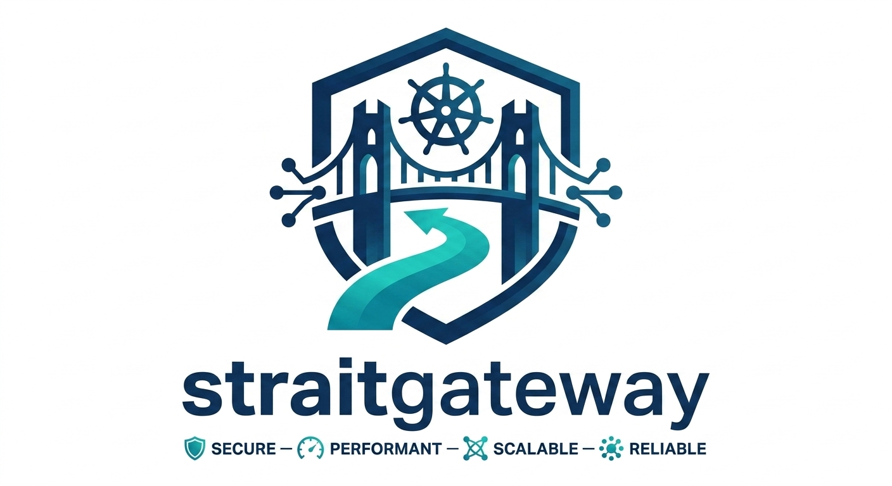

<div align="center">


<br/>

**eBPF-Native Kubernetes CNI, Service Load Balancer, Gateway API, & Multi-Cluster Transit Gateway**

[](https://go.dev)
[](https://kubernetes.io)
[](https://gateway-api.sigs.k8s.io)
[](https://ebpf.io)
[](LICENSE)

</div>

---

## Overview

**StraitGateway** is a next-generation cloud-native networking platform built from the ground up for modern Linux kernels (`>= 5.15`). Bypassing legacy `iptables`, `IPVS`, and `veth` pairs, StraitGateway executes line-rate packet routing, load balancing, and security policies directly inside the kernel via **eBPF**, **NetKit**, and **TCX**.

It replaces fragmented networking tools with a unified architecture powered by a strict **Intermediate Representation (IR)** compiler:

- 🚀 **Zero-Overhead CNI**: NetKit-powered container interconnect with automatic PerNode IPAM.
- ⚡ **Complete Kube-Proxy Replacement**: Constant-time `O(1)` L4 Service Load Balancing using Google Maglev consistent hashing, Direct Server Return (DSR), and XDP NodePort acceleration.
- 🌐 **Gateway API v1.6.1 Standard**: First-class Gateway controller (`straitgateway.io/skgateway`) supporting `HTTPRoute`, `GRPCRoute`, `TLSRoute`, `TCPRoute`, and `UDPRoute`.
- 🌉 **Multi-Cluster Transit Gateway**: Global mesh and hub-and-spoke topologies with 32-bit segment isolation (`TransitSegment`) and automated WireGuard encryption.
- 🛡️ **Identity-Aware Zero Trust**: Numeric identity enforcement (`StraitNetworkPolicy`), BPF Linux Security Module (LSM) socket hooks, and default-deny protection.
- 📊 **Kernel-Level Observability**: Prometheus metrics (`straitgateway_*`), OpenTelemetry tracing, and eBPF ring buffer flow events.

---

## Architecture at a Glance

StraitGateway enforces a strict architectural boundary: **Controllers produce IR; the Compiler translates IR to kernel BPF maps**. Controllers never touch kernel state directly.

```
 Kubernetes API Server (Gateway API, CRDs, Pods, Services)
               │
               ▼
   [ sg-controller ]  ── (Compiles CRDs into DataplaneState IR)
               │
      gRPC Sync Stream
               │
               ▼
   [ straitgatewayd ] (DaemonSet on every node)
               │
    ┌──────────┴──────────┐
    ▼                     ▼
[ IR Compiler ]     [ CNI Server ]
    │                     │
    ├─► BPF Maps (ct, lb, identity, policy, route)
    ├─► TCX / XDP Programs
    ├─► BPF LSM Hooks (socket_connect, socket_bind)
    ├─► NetKit Device Links
    └─► WireGuard Mesh Tunnels (wg-strait)
```

---

## Documentation

Explore the comprehensive documentation suite in the [`docs/`](docs) directory:

| Document | Focus Area |
| :--- | :--- |
| **[Overview](docs/overview.md)** | Problems solved, eBPF & NetKit foundations, and core design principles. |
| **[Architecture](docs/architecture.md)** | Control plane (`sg-controller`), daemon (`straitgatewayd`), CLI, UI, and IR compiler pipeline. |
| **[Capabilities](docs/capabilities.md)** | CNI, Maglev load balancing, DSR, NodePort XDP, BGP/BFD routing, and telemetry. |
| **[Security Architecture](docs/security.md)** | Identity-based policies, `StraitNetworkPolicy`, BPF LSM socket hooks, and WireGuard. |
| **[Multi-Cluster Transit Gateway](docs/transit-gateway.md)** | Mesh & Hub-Spoke topologies, 32-bit segment isolation (`TransitSegment`), and attachments. |
| **[Gateway API v1.6.1](docs/gateway-api.md)** | Controller `straitgateway.io/skgateway`, GatewayClass `skgateway`, and full route guides (`HTTPRoute`, `TCPRoute`, `UDPRoute`, `TLSRoute`, `GRPCRoute`). |
| **[Installation & Operations Guide](docs/guide.md)** | Standalone scripts (Kind, Minikube, K3s, Kubeadm) and complete Helm deployment, uninstallation, and upgrade guides. |

---

## Quick Start (Production Helm)

### 1. Install Gateway API CRDs
```bash
kubectl apply --server-side -f https://github.com/kubernetes-sigs/gateway-api/releases/download/v1.6.1/standard-install.yaml
```

### 2. Install StraitGateway via Helm
```bash
helm upgrade --install straitgateway ./straitgateway-helm \
  --namespace straitgateway-system --create-namespace \
  --set global.clusterName="my-cluster" \
  --set kubeProxyReplacement.enabled=true \
  --set dataplane.overlay=Native \ 
  --wait --timeout=15m
```

### 3. Verify Deployment
```bash
kubectl rollout status daemonset/straitgatewayd -n straitgateway-system
kubectl get gatewayclass skgateway
```

---

## Local Development & Testing

StraitGateway provides Makefile targets for development and testing:

```bash
# Build all Go binaries (sg-controller, straitgatewayd, sg-cli)
make build

# Run unit tests with race detector
make test

# Spin up a Kind cluster and install StraitGateway
make kind-create
make kind-install

# Lint Helm charts and verify templates
make helm-lint
make helm-template
```

---

## Component Matrix

| Component | Binary | Description |
| :--- | :--- | :--- |
| **Controller** | `sg-controller` | Cluster-wide manager reconciling K8s CRDs into Dataplane IR |
| **Node Daemon** | `straitgatewayd` | Privileged agent compiling IR to BPF maps, NetKit, and WireGuard |
| **CLI Tool** | `sg-cli` | Diagnostic tool for inspecting kernel maps, flows, and identities |
| **UI Dashboard** | `straitgateway-ui` | Angular web console for topology visualization and live flow tracing |
| **CNI Plugin** | `straitgateway` | Host CNI binary invoked by containerd/CRI-O runtimes |

---

## License

StraitGateway is open-source software licensed under the [Apache-2.0 License](LICENSE).
