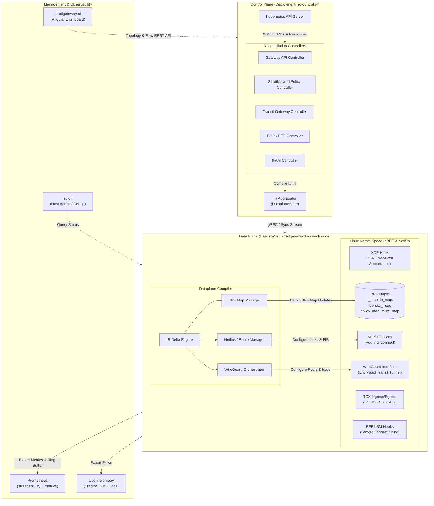

# StraitGateway: Architecture

StraitGateway is architected around a strict separation of concerns between the Kubernetes control plane and the high-performance Linux kernel dataplane. Rather than modifying kernel network state directly from controller loops, StraitGateway employs an **Intermediate Representation (IR)** compiler model.

---

## Architectural Invariants

The design enforces three non-negotiable architectural invariants:

1. **Controllers Produce IR Only**: Kubernetes controllers (`sg-controller`) reconcile Kubernetes CRDs, Gateway API resources, and core primitives into strongly typed IR structures. Controllers **never** interact with BPF maps, netlink interfaces, or wireguard sockets directly.
2. **Compiler Is the Single Source of Dataplane Truth**: The **Dataplane Compiler** within `straitgatewayd` is the only component authorized to translate IR objects into kernel BPF maps, NetKit devices, and routing tables.
3. **Generation-Tracked Idempotence**: Every IR object maintains a monotonic `Generation` counter. The compiler computes diffs against the active kernel state and applies only atomic delta updates.

---

## High-Level System Architecture



---

## Component Breakdown

### 1. `sg-controller` (Cluster Control Plane)
Runs as a deployment (with optional leader election for high availability). Its responsibilities include:
- Watching Kubernetes core resources (`Service`, `Endpoints`, `Namespace`, `Pod`, `Node`).
- Watching Gateway API v1.6.1 resources (`GatewayClass`, `Gateway`, `HTTPRoute`, `GRPCRoute`, `TLSRoute`, `TCPRoute`, `UDPRoute`, `ReferenceGrant`).
- Watching StraitGateway CRDs (`TransitGateway`, `TransitSegment`, `TransitSegmentAttachment`, `TransitSegmentRoute`, `StraitNetworkPolicy`, `BGPPeer`).
- Performing label hashing and assigning cluster-wide numeric security `Identity` values.
- Emitting consolidated `DataplaneState` IR objects to node agents.

### 2. `straitgatewayd` (Node Dataplane Daemon)
Runs as a privileged `DaemonSet` on every Kubernetes node:
- **eBPF Program Lifecycle**: Compiles, loads, verifies, and attaches eBPF bytecode using modern `TCX`, `XDP`, and `BPF LSM` interfaces.
- **IR Compiler**: Ingests `DataplaneState`, performs delta computation against current kernel state, and executes atomic BPF map modifications.
- **CNI Server**: Listens on local domain socket (`/run/straitgateway/daemon.sock`) to handle CNI `ADD`, `DEL`, and `CHECK` commands from container runtimes (containerd/CRI-O).
- **NetKit & IPAM Manager**: Configures high-performance NetKit interfaces into container network namespaces and manages per-node pod IP pools.
- **WireGuard Tunnel Manager**: Dynamically configures `wg-strait` interfaces, keys, and allowed IP ranges for inter-node and multi-cluster transit traffic.

### 3. `sg-cli` (Command-Line Interface)
An administrative and diagnostic binary for engineers and automation:
- Inspect active BPF maps (`ct_map`, `lb_map`, `identity_map`, `policy_map`).
- Query endpoint health, Maglev lookup tables, and transit peering status.
- Trigger real-time flow tracing and packet dumps directly from the eBPF ring buffer.

### 4. `straitgateway-ui` (Topology Dashboard)
A modern Angular-based web dashboard offering:
- Real-time visualization of cluster topologies, transit mesh attachments, and segment isolation.
- Interactive traffic flow visualizer and packet latency analysis.
- Live inspection of Gateway API routes and active network policy enforcement rules.

### 5. CNI Plugin Binary (`/opt/cni/bin/straitgateway`)
A lightweight binary invoked by the container runtime. It delegates the execution to `straitgatewayd` via UNIX domain socket, passing network configuration and namespace file descriptors.

---

## Dataplane Intermediate Representation (IR)

The Intermediate Representation is defined in Go package `github.com/msaeedb40/straitgateway/dataplane/ir`. The key data structures are:

```go
type DataplaneState struct {
    Generation  Generation
    Services    []ServiceIR
    Policies    []PolicyIR
    Routes      []RouteIR
    NatRules    []NatIR
    Gateways    []GatewayIR
    Transit     []TransitIR
    Identities  []IdentityIR
}
```

### Key IR Structures

| IR Type | Source Controller | Compiled Kernel Target |
| :--- | :--- | :--- |
| `ServiceIR` | Service / Endpoints Controller | `lb_map` (Maglev / Round-Robin backend selections) |
| `PolicyIR` | StraitNetworkPolicy Controller | `policy_map` (Identity tuples, action, port, protocol) |
| `RouteIR` | Routing / BGP Controller | Netlink FIB routes, kernel routing tables |
| `NatIR` | NAT Controller | `ct_map` (SNAT, DNAT, Masquerade, NAT64) |
| `GatewayIR` | Gateway API Controller | `gateway_map` & L7 proxy dispatch |
| `TransitIR` | Transit Gateway Controller | WireGuard peer configurations & tunnel routes |
| `IdentityIR`| Identity Controller | `identity_map` (IP/Prefix -> numeric security Identity) |

---

## Packet Processing Flow (In-Kernel)

When a packet arrives on a physical interface or container NetKit link:

1. **XDP Ingress**:
   - Packets targeted for NodePort services or Direct Server Return (DSR) are evaluated at the XDP driver level.
   - Non-matching packets proceed to the network stack.
2. **TCX Ingress**:
   - Source IP is resolved to a numeric security `Identity` via `identity_map`.
   - Active connection tracking is checked in `ct_map`. Established flows bypass policy checks.
   - For new flows, `policy_map` evaluates ingress `StraitNetworkPolicy` rules. If denied, the packet is dropped immediately.
3. **L4 Service Proxying**:
   - Destination ClusterIP/Port is matched in `lb_map`.
   - Consistent hashing (Maglev) selects an active, healthy backend.
   - Packet headers are updated (DNAT) and connection tracking state is committed to `ct_map`.
4. **Transit & Routing**:
   - If destination belongs to a remote cluster or segment, the packet is routed through the WireGuard encryptor and encapsulated.
   - Local pod traffic is redirected directly to the pod's NetKit interface.
