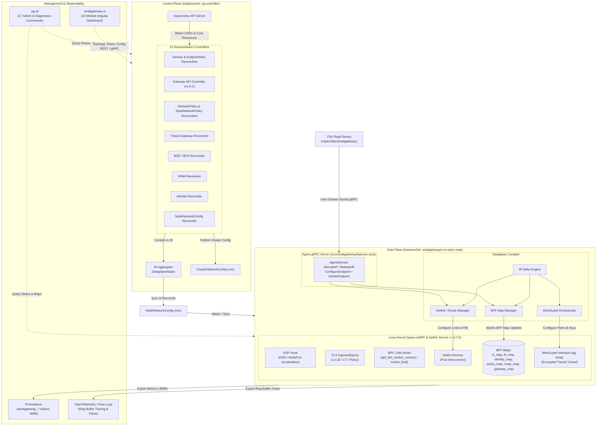

# StraitGateway: Architecture

StraitGateway is architected around a strict separation of concerns between the Kubernetes control plane and the high-performance Linux kernel dataplane. Rather than modifying kernel network state directly from controller loops, StraitGateway employs an **Intermediate Representation (IR)** compiler model.

---

## Architectural Invariants

The design enforces four non-negotiable architectural invariants:

1. **Controllers Produce IR Only**: Kubernetes controllers (`sg-controller`) reconcile Kubernetes CRDs, Gateway API resources, and core primitives into strongly typed IR structures. Controllers **never** interact with BPF maps, netlink interfaces, or wireguard sockets directly.
2. **Compiler Is the Single Source of Dataplane Truth**: The **Dataplane Compiler** within `straitgatewayd` is the only component authorized to translate IR objects into kernel BPF maps, NetKit devices, and routing tables.
3. **Generation-Tracked Idempotence**: Every IR object maintains a monotonic `Generation` counter. The compiler computes diffs against the active kernel state and applies only atomic delta updates.
4. **Node & Cluster State Synchronization via CRDs**: Cluster-level network parameters (`ClusterNetworkConfig`) and per-node observed dataplane status (`NodeNetworkConfig`) are continuously reconciled, guaranteeing full visibility into BPF map revisions, CNI health, and kube-proxy replacement state.

---

## High-Level System Architecture



---

## Component Breakdown

### 1. `sg-controller` (Cluster Control Plane Manager)
Runs as a high-availability Kubernetes `Deployment` with leader election (`straitgateway-controller-leader`). It initializes and coordinates **10 specialized reconcilers**:

1. **`ServiceReconciler`**: Reconciles Kubernetes `Service` definitions, assigning VIPs and load-balancing algorithms.
2. **`EndpointSliceReconciler`**: Reconciles backend pods and endpoints, building Maglev hash lookup tables.
3. **`NetworkPolicyReconciler`**: Translates standard Kubernetes `NetworkPolicy` specifications into identity-based IR rules.
4. **`StraitNetworkPolicyReconciler`**: Translates multidimensional `StraitNetworkPolicy` rules (supporting namespaces, pods, clusters, segments, and Gateway API routes).
5. **`GatewayReconciler`**: Reconciles Kubernetes Gateway API v1.6.1 resources (`GatewayClass`, `Gateway`, `HTTPRoute`, `GRPCRoute`, `TLSRoute`, `TCPRoute`, `UDPRoute`, `ReferenceGrant`).
6. **`TransitGatewayReconciler`**: Manages cross-cluster transit topologies (`Mesh`, `HubAndSpoke`, `PeerToPeer`, `GatewayToGateway`) and 32-bit segment isolation.
7. **`BGPPeerReconciler`**: Manages dynamic BGP peering sessions, BFD link failure detection (`BFDSession`), and service VIP route advertisements.
8. **`IdentityReconciler`**: Watches pods across the cluster, computes deterministic 32-bit security identities from label hashes, and distributes the global identity registry.
9. **`IPAMReconciler`**: Discovers cluster pod CIDRs dynamically from the Kubernetes API and provisions per-node CIDR slices.
10. **`NodeNetworkConfigReconciler`**: Reconciles the desired and observed dataplane state for every node in the cluster via `NodeNetworkConfig` (`nnc`).

### 2. `straitgatewayd` (Node Dataplane Daemon)
Runs as a privileged `DaemonSet` on every Kubernetes node:
- **eBPF Program Lifecycle**: Compiles, loads, verifies, and attaches eBPF bytecode using modern `TCX`, `XDP`, and `BPF LSM` interfaces. Pins BPF maps to `/sys/fs/bpf/straitgateway/`.
- **Kernel Compatibility Check**: Verifies that the host kernel satisfies `MinKernelVersion = "6.7.0"` (mandatory for NetKit container datapath and TCX).
- **gRPC Agent Service**: Listens on local Unix domain socket `/run/straitgateway/daemon.sock` to service CNI plugin requests (`AllocateIP`, `ReleaseIP`, `ConfigureEndpoint`, `DeleteEndpoint`).
- **IR Compiler**: Ingests `DataplaneState`, performs delta computation against current kernel state, and executes atomic BPF map modifications.
- **NetKit & IPAM Manager**: Configures high-performance NetKit primary/peer links into container network namespaces and manages node-local pod IP allocations.
- **WireGuard Tunnel Manager**: Dynamically configures `wg-strait` interfaces, keys, and allowed IP ranges for inter-node and multi-cluster transit traffic.

### 3. CNI Plugin Binary (`/opt/cni/bin/straitgateway`)
A thin binary invoked by container runtimes (`containerd`, `CRI-O`). It communicates over `/run/straitgateway/daemon.sock` via gRPC, delegating interface creation, IPAM allocation, and BPF identity assignment to `straitgatewayd`.

### 4. `sg-cli` (Command-Line Interface)
An administrative and diagnostic binary for operators with **17 modular subcommands**:
- `status`: Comprehensive cluster, node, and dataplane readiness status.
- `gateway`: Inspect active Gateway API classes, listeners, and routes.
- `node`: Query node network states and IPAM allocations.
- `bgp`: View BGP peering sessions and BFD status.
- `policy`: Inspect active security policies and identity mappings.
- `transit`: Inspect transit mesh topology, segments, and peer links.
- `endpoint`: Query pod endpoints, interface indices, and identities.
- `cluster`: Inspect cluster network configuration (`ClusterNetworkConfig`).
- `wireguard`: Query WireGuard keys, handshake timestamps, and transfer bytes.
- `ipsec`: Manage optional IPsec encryption tunnels.
- `config`: View and validate runtime configuration.
- `ui`: Port-forward and open the `straitgateway-ui` dashboard.
- `export` / `import`: Backup and restore network and transit configurations.
- `install` / `upgrade`: CLI lifecycle operations.
- `version`: Display version, commit hash, and build timestamp.

### 5. `straitgateway-ui` (Topology & Management Console)
An Angular dashboard organized into **15 operational feature modules**:
- **Dashboard**: High-level health scorecards, throughput gauges, active flows, and alerts.
- **Gateways**: Gateway API listeners, attached routes, TLS certificates, and canary weights.
- **Nodes**: Per-node dataplane readiness, NetKit interfaces, and BPF map revisions.
- **Tunnels**: Cross-cluster WireGuard/IPsec tunnels, transfer metrics, and latency graphs.
- **Flows**: Live eBPF flow log stream with protocol, action, and drop-reason filters.
- **Packets**: In-browser real-time packet capture directly from kernel eBPF ring buffers.
- **Topology**: Interactive D3-powered graph of nodes, pods, services, and transit mesh.
- **Services & Endpoints**: Maglev lookup tables, backend health, and DSR status.
- **eBPF**: Live inspector for pinned BPF maps (`ct_map`, `lb_map`, `identity_map`, `policy_map`), programs, and hooks (TCX, XDP, LSM).
- **CNI**: Pod network namespace mappings and IPAM pool utilization.
- **Events & Logs**: Structured kernel and controller event audit timeline.
- **Metrics**: High-resolution Prometheus charts (packet counts, drop reasons, latencies).
- **Traces**: Distributed trace waterfalls for multi-hop transit packets.
- **Settings**: Sub-configs for CNI, eBPF, Gateway, General, Network, Observability, and Security.
- **Authentication**: OIDC / Token-based authentication with Angular route guards.

---

## Protobuf Service Contracts (`proto/`)

StraitGateway structures all internal communication via Protocol Buffers in `proto/`:

| Package | Service | Protocol / Transport | Purpose |
| :--- | :--- | :--- | :--- |
| `proto/agent/v1` | `AgentService` | Unix Domain Socket gRPC | CNI IP allocation, endpoint lifecycle, readiness checks |
| `proto/dataplane/v1` | `DataplaneService` | gRPC | BPF map statistics and real-time eBPF ring buffer flow events |
| `proto/gateway/v1` | `GatewayService` | gRPC / REST | Gateway and Route inspection and status reporting |
| `proto/transit/v1` | `TransitService` | gRPC / REST | Segment listings, peering status, and tunnel metrics |
| `proto/bgp/v1` | `BGPService` | gRPC | BGP neighbor states, advertised routes, and BFD sessions |
| `proto/policy/v1` | `PolicyService` | gRPC | Identity mappings and compiled policy rules |
| `proto/service/v1` | `ServiceService` | gRPC | Service VIPs, Maglev backend allocations, and health |
| `proto/health/v1` | `HealthService` | HTTP / gRPC | Readiness and liveness probes (`/healthz`, `/readyz`) |
| `proto/common/v1` | Common Messages | N/A | Shared types: `IPAddress`, `IPPrefix`, `L4Protocol`, observability attributes |

---

## Dataplane Intermediate Representation (IR)

The Intermediate Representation is defined in Go package `github.com/msaeedb40/straitgateway/dataplane/ir`:

```go
type DataplaneState struct {
    Generation  Generation
    Services    []ServiceIR
    Policies    []PolicyIR
    Routes      []RouteIR
    NatRules    []NatIR
    Gateways    []GatewayIR
    Transit     []TransitIR
    Identities  []IdentityIR
}
```

### Key IR Structures & Compiled Targets

| IR Type | Source Controller | Compiled Kernel Target |
| :--- | :--- | :--- |
| `ServiceIR` | Service / EndpointSlice Controller | `lb_map` (Maglev consistent hash tables, prime size: 128) |
| `PolicyIR` | StraitNetworkPolicy / NetworkPolicy Controller | `policy_map` (Identity tuples, action, port, protocol) |
| `RouteIR` | Routing / BGP Controller | Netlink FIB routes, kernel routing tables |
| `NatIR` | NAT Controller | `ct_map` (SNAT, DNAT, Masquerade) |
| `GatewayIR` | Gateway API Controller | `gateway_map` & L7 proxy dispatch |
| `TransitIR` | Transit Gateway Controller | WireGuard peer configurations & encrypted tunnel routes |
| `IdentityIR`| Identity Controller | `identity_map` (IP/Prefix -> numeric 32-bit security Identity) |

---

## Packet Processing Flow (In-Kernel)

When a packet arrives on a physical interface or container NetKit link:

1. **XDP Ingress**:
   - Packets targeted for NodePort services or Direct Server Return (DSR) are evaluated at the XDP driver level before socket allocation.
   - Non-matching packets proceed directly to the network stack.
2. **TCX Ingress**:
   - Source IP is resolved to a numeric security `Identity` via `identity_map`.
   - Active connection tracking is checked in `ct_map`. Established flows bypass policy checks.
   - For new flows, `policy_map` evaluates ingress security rules. Denied packets are dropped immediately in the kernel.
3. **BPF LSM Socket Hooks**:
   - Socket connections initiated on the host are evaluated by `bpf_lsm_socket_connect`. Disallowed outbound connections return `-EPERM` before SYN packets enter the network.
   - Container port bindings are restricted by `bpf_lsm_socket_bind`.
4. **L4 Service Proxying**:
   - Destination ClusterIP/Port is matched in `lb_map`.
   - Consistent hashing (Maglev) selects an active, healthy backend.
   - Packet headers are rewritten (DNAT) and connection tracking state is committed to `ct_map`.
5. **Transit & Routing**:
   - If destination belongs to a remote cluster or transit segment, the packet is redirected to `wg-strait` and encapsulated with ChaCha20-Poly1305 encryption.
   - Local pod traffic is redirected directly to the pod's NetKit interface.
