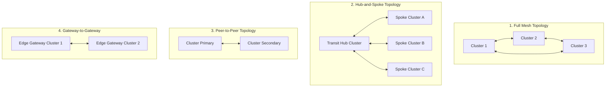

# StraitGateway: Multi-Cluster Transit Gateway

StraitGateway includes a high-performance **Multi-Cluster Transit Gateway** engine designed to interconnect distributed Kubernetes clusters across different clouds, regions, on-premises datacenters, and VPCs. It introduces software-defined 32-bit segment isolation and automated kernel-level WireGuard encryption.

---

## Transit Topologies

StraitGateway supports four distinct network topologies configurable via the `TransitGateway` CRD:



1. **`Mesh` (Default)**: Every cluster establishes direct encrypted peering with every other cluster. Best for low-latency, geographically dispersed clusters where direct routing is preferred.
2. **`HubAndSpoke`**: Spoke clusters peer exclusively with a central Transit Hub cluster. The hub enforces centralized firewall policies, segment isolation, and route distribution.
3. **`PeerToPeer`**: Explicit point-to-point connections between designated cluster pairs.
4. **`GatewayToGateway`**: Designated edge gateway nodes in each cluster terminate transit tunnels, isolating internal node subnets from cross-cluster interfaces.

---

## 32-Bit Segment Isolation (`TransitSegment`)

StraitGateway isolates cross-cluster traffic using a 32-bit segmentation model:

- **Segment 0 (Backbone)**: The default backbone inter-cluster routing segment. All clusters in the transit mesh can route across Segment 0 unless explicitly restricted.
- **Isolated Segments (`SegmentID: 1` to `4294967295`)**: User-defined virtual routing and forwarding domains (VRFs). Segments are completely isolated at the eBPF layer. A pod on Segment 100 cannot communicate with Segment 200 unless an explicit `TransitSegmentRoute` or cross-segment policy is configured.

---

## Core Transit Custom Resources (CRDs)

StraitGateway provides four primary CRDs in `straitgateway.io/v1alpha1` for multi-cluster transit:

### 1. `TransitGateway`
Configures local cluster identity, peering topology, and encryption settings.

```yaml
apiVersion: straitgateway.io/v1alpha1
kind: TransitGateway
metadata:
  name: primary-transit-gw
spec:
  # Unique string identifier for this cluster in the transit network
  clusterID: "cluster-us-east-1"
  
  # Topology: Mesh, HubAndSpoke, PeerToPeer, GatewayToGateway
  topology: Mesh
  
  # Encryption: WireGuard, IPsec, None
  encryption: WireGuard
  
  # Backbone inter-cluster segment ID (default 0)
  backboneSegmentID: 0
  
  # Optional: Restrict transit processing to specific gateway nodes
  nodeSelector:
    matchLabels:
      node-role.kubernetes.io/transit-gateway: "true"
```

### 2. `TransitSegment`
Defines an isolated virtual network domain.

```yaml
apiVersion: straitgateway.io/v1alpha1
kind: TransitSegment
metadata:
  name: pci-dss-segment
spec:
  # 32-bit segment identifier
  segmentID: 100
  description: "Isolated PCI-DSS payment processing network domain"
```

### 3. `TransitSegmentAttachment`
Binds clusters, gateways, or namespaces to specific transit segments.

```yaml
apiVersion: straitgateway.io/v1alpha1
kind: TransitSegmentAttachment
metadata:
  name: payment-mesh-attachment
spec:
  # Must contain at least two attachment points to bridge
  attachments:
    - name: "cluster-us-east-1"
      segmentID: 100
    - name: "cluster-eu-west-1"
      segmentID: 100
```

### 4. `TransitSegmentRoute`
Defines destination CIDR routes across segment attachments.

```yaml
apiVersion: straitgateway.io/v1alpha1
kind: TransitSegmentRoute
metadata:
  name: route-eu-payment-cidr
spec:
  # Destination CIDR in remote cluster
  cidr: "10.244.0.0/16"
  
  # Next hop attachment name
  nextHop: "payment-mesh-attachment"
  
  # Segment this route operates within
  segmentID: 100
```

---

## Automated WireGuard Encryption Pipeline

When transit peering is established:
1. `sg-controller` generates an ephemeral or static WireGuard keypair for the local cluster.
2. Peering public keys and tunnel endpoints are exchanged securely via Kubernetes secrets or GitOps synchronization.
3. The node agent `straitgatewayd` provisions a `wg-strait` kernel interface.
4. eBPF redirection programs steer cross-cluster packets into the WireGuard interface, encapsulating payload bytes with **ChaCha20-Poly1305** encryption before egressing the physical network.
